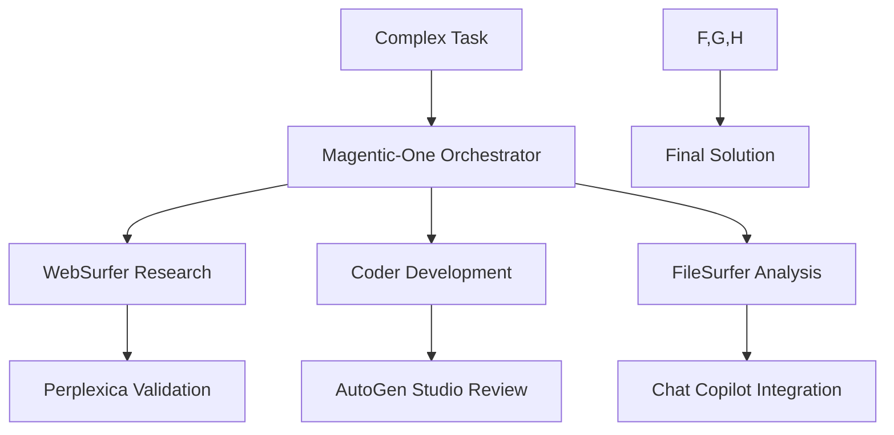

# 🌟 Magentic-One Multi-Agent Platform

**Microsoft's Advanced Multi-Agent Task Solving System**  
**AI Research Platform - Tailscale Network Integration**

---

## 🚀 Overview

Magentic-One is Microsoft's flagship multi-agent system designed to solve complex, open-ended tasks that require coordination across multiple specialized agents. Our implementation extends this concept with local Ollama models and Tailscale network integration.

### ✅ What's Included

- **Advanced Multi-Agent Coordination** - Orchestrator-led task delegation
- **Specialized Agent Roles** - Web, File, Code, and Terminal operations  
- **Complex Workflow Management** - Multi-step task execution
- **Local Ollama Integration** - 5 specialized models for different roles
- **Tailscale Network Access** - Available across your mesh network
- **Safety Protocols** - Human approval and command validation

---

## 🌐 Access Information

### Platform Access
- **Magentic-One Platform**: [http://100.123.10.72:8086](http://100.123.10.72:8086)
- **Network**: Tailscale VPN (`100.123.10.72`)
- **Port**: `8086`
- **Status**: 🟡 Configured (Ready for Deployment)

### Integration Points
- **Control Panel**: [http://100.123.10.72:10500/control-panel.html](http://100.123.10.72:10500/control-panel.html)
- **Applications Dashboard**: [http://100.123.10.72:10500/applications.html](http://100.123.10.72:10500/applications.html)
- **AutoGen Studio**: [http://100.123.10.72:8085](http://100.123.10.72:8085) (Complementary)

---

## 🤖 Agent Architecture

### 1. Orchestrator Agent
**Role**: Task Coordinator and Planner  
**Model**: `llama3.2:3b`  
**Capabilities**:
- Breaks down complex tasks into manageable subtasks
- Creates detailed execution plans
- Delegates tasks to appropriate specialist agents  
- Monitors progress and adjusts plans dynamically
- Synthesizes results from multiple agents

### 2. WebSurfer Agent
**Role**: Web Research and Information Gathering  
**Model**: `mistral:latest`  
**Capabilities**:
- Navigates websites and web applications
- Performs comprehensive web research
- Extracts data from multiple sources
- Verifies information accuracy
- Downloads and processes web content

### 3. FileSurfer Agent  
**Role**: File System Navigation and Analysis  
**Model**: `deepseek-coder:6.7b`  
**Capabilities**:
- Explores and analyzes file systems
- Reads multiple file formats (text, JSON, CSV, logs)
- Extracts and organizes data from documents
- Creates structured summaries and reports
- Manages file organization and categorization

### 4. Coder Agent
**Role**: Software Development and Analysis  
**Model**: `deepseek-coder:6.7b`  
**Capabilities**:
- Writes code in multiple programming languages
- Analyzes and debugs existing codebases  
- Creates comprehensive test suites
- Optimizes code performance and security
- Generates technical documentation

### 5. ComputerTerminal Agent
**Role**: System Operations and Command Execution  
**Model**: `llama3.2:3b`  
**Capabilities**:
- Executes shell commands and scripts
- Installs packages and manages dependencies
- Monitors system performance
- Automates routine system tasks
- **Safety**: Human approval required for system changes

---

## 🎯 Pre-Configured Teams

### Research Team
**Agents**: Orchestrator, WebSurfer, FileSurfer  
**Best For**: Information gathering, analysis, and documentation  
**Example**: "Research the latest developments in AI agent frameworks"

### Development Team  
**Agents**: Orchestrator, Coder, ComputerTerminal, FileSurfer  
**Best For**: Software development, testing, and deployment  
**Example**: "Create a Python web scraper with error handling"

### Analysis Team
**Agents**: Orchestrator, FileSurfer, Coder  
**Best For**: Data processing, analysis, and reporting  
**Example**: "Analyze system performance logs for bottlenecks"

### Full Multi-Agent Team
**Agents**: All 5 agents working together  
**Best For**: Complex, multi-domain tasks requiring all capabilities  
**Example**: "Build and deploy a complete web application with monitoring"

---

## 🔄 Workflow Examples

### 1. Web Research Project
**Workflow**: Research Team → 5 rounds of collaboration

```
🎯 Task: "Research the latest developments in AI agent frameworks"

Round 1 - Orchestrator: Creates comprehensive research plan
Round 2 - WebSurfer: Searches academic and industry sources  
Round 3 - FileSurfer: Organizes and catalogs findings
Round 4 - Orchestrator: Reviews progress and refines approach
Round 5 - WebSurfer: Gathers additional targeted information

📋 Result: Comprehensive research report with citations
```

### 2. Code Development Project  
**Workflow**: Development Team → Multi-phase development

```
🎯 Task: "Create a Python web scraper with error handling"

Phase 1 - Orchestrator: Plans development approach and requirements
Phase 2 - Coder: Designs architecture and writes initial code
Phase 3 - ComputerTerminal: Sets up development environment
Phase 4 - Coder: Implements features and error handling
Phase 5 - FileSurfer: Organizes project structure and documentation

📋 Result: Complete, tested application with documentation
```

### 3. Data Analysis Project
**Workflow**: Analysis Team → Systematic data processing

```
🎯 Task: "Analyze system performance logs for bottlenecks"

Phase 1 - Orchestrator: Defines analysis objectives and methodology
Phase 2 - FileSurfer: Examines log files and data quality
Phase 3 - Coder: Creates analysis scripts and visualization tools
Phase 4 - FileSurfer: Validates findings and organizes results
Phase 5 - Orchestrator: Synthesizes insights and recommendations

📋 Result: Detailed performance analysis with actionable insights
```

### 4. Complex Multi-Domain Task
**Workflow**: Full Team → Comprehensive solution development

```
🎯 Task: "Build and deploy a complete web application with monitoring"

Coordination - Orchestrator: Creates overall project plan
Research - WebSurfer: Researches best practices and technologies
Development - Coder: Implements application components
System Setup - ComputerTerminal: Configures deployment environment
Documentation - FileSurfer: Creates comprehensive project documentation
Integration - All Agents: Collaborative testing and refinement

📋 Result: Production-ready application with full documentation
```

---

## 🛡️ Safety & Security Features

### Human Approval System
- **Critical Operations**: System-level changes require approval
- **Command Validation**: Restricted command filtering
- **Impact Assessment**: Pre-execution safety analysis

### Restricted Commands
```bash
# Blocked for safety
rm -rf, sudo rm, format, delete, DROP TABLE
shutdown, reboot, passwd, adduser, deluser
```

### Allowed Web Domains
```
github.com, stackoverflow.com, python.org, microsoft.com
docs.python.org, pypi.org, wikipedia.org, arxiv.org
```

### Execution Limits
- **Max Execution Time**: 5 minutes per task
- **File Size Limits**: 100MB maximum
- **Session Management**: Automatic cleanup and monitoring

---

## 🔧 Technical Configuration

### Model Assignments
```json
{
  "coordinator": "llama3.2:3b",
  "web_surfer": "mistral:latest", 
  "file_surfer": "deepseek-coder:6.7b",
  "coder": "deepseek-coder:6.7b",
  "terminal": "llama3.2:3b"
}
```

### Platform Configuration
```json
{
  "host": "0.0.0.0",
  "port": 8086,
  "cors_enabled": true,
  "ollama_base_url": "http://localhost:11434/v1",
  "api_key": "ollama"
}
```

### Dependencies
```bash
# Required packages
autogen-agentchat>=0.5.7
autogen-ext[magentic-one,openai]>=0.5.7
playwright>=1.48.0

# Browser setup
playwright install --with-deps chromium
```

---

## 🚀 Getting Started

### Step 1: Verify Prerequisites  
```bash
# Check Ollama models
ollama list

# Required models:
# - llama3.2:3b
# - mistral:latest  
# - deepseek-coder:6.7b
```

### Step 2: Launch Platform
```bash
cd /home/keith/chat-copilot
source autogen-env/bin/activate
python magentic_one_simple.py
```

### Step 3: Access Interface
1. Open [http://100.123.10.72:8086](http://100.123.10.72:8086) (when deployed)
2. Select a workflow team (Research, Development, Analysis, or Full)
3. Input your task description
4. Monitor multi-agent collaboration in real-time

### Step 4: Test Workflows
```python
# Example usage
from magentic_one_simple import MagenticOnePlatform
import asyncio

platform = MagenticOnePlatform()

# Run research workflow
task = "Research quantum computing applications in AI"
result = await platform.run_workflow("web_research", task)
```

---

## 📊 Capabilities Comparison

| Feature | AutoGen Studio | Magentic-One Platform |
|---------|----------------|----------------------|
| **Agent Types** | General-purpose | Specialized roles |
| **Coordination** | User-guided | Autonomous orchestration |
| **Task Complexity** | Medium | High complexity |
| **Web Interaction** | Limited | Full web browsing |
| **File Operations** | Basic | Advanced file analysis |
| **System Commands** | Manual | Automated with safety |
| **Workflow Management** | Simple | Multi-phase coordination |
| **Safety Features** | Basic | Comprehensive protocols |

---

## 🔍 Monitoring & Management

### Platform Status
```bash
# Check agent status
python -c "from magentic_one_simple import MagenticOnePlatform; p = MagenticOnePlatform(); print(p.get_platform_status())"

# View configuration
cat ~/.autogenstudio/magentic-one/platform_status.json
```

### Workflow Monitoring
- **Real-time Progress**: Live agent interaction display
- **Round-by-Round Analysis**: Detailed conversation logs
- **Result Compilation**: Automated summary generation
- **Performance Metrics**: Execution time and efficiency tracking

### Log Management
```bash
# Platform logs
tail -f ~/.autogenstudio/magentic-one/platform.log

# Workflow results
ls ~/.autogenstudio/magentic-one/workflows/

# Agent conversations
cat ~/.autogenstudio/magentic-one/conversations/latest.json
```

---

## 🎯 Use Cases & Applications

### Software Development
- **Full-Stack Development**: End-to-end application creation
- **Code Review & Analysis**: Multi-perspective code evaluation
- **DevOps Automation**: Deployment and monitoring setup
- **Technical Documentation**: Comprehensive project documentation

### Research & Analysis
- **Academic Research**: Literature review and synthesis
- **Market Analysis**: Competitive intelligence gathering
- **Data Science Projects**: End-to-end data analysis workflows
- **Technology Assessment**: Evaluation of tools and frameworks

### System Administration
- **Infrastructure Setup**: Automated environment configuration
- **Performance Optimization**: System bottleneck identification
- **Security Auditing**: Multi-agent security assessment
- **Maintenance Automation**: Routine task orchestration

### Business Intelligence
- **Process Optimization**: Workflow analysis and improvement
- **Decision Support**: Multi-perspective analysis and recommendations
- **Knowledge Management**: Information organization and retrieval
- **Strategic Planning**: Collaborative planning and analysis

---

## 🔗 Integration with AI Research Platform

### Ecosystem Position
Magentic-One complements the existing AI Research Platform services:

- **OpenWebUI**: Individual LLM interactions
- **AutoGen Studio**: Team-based conversations  
- **Magentic-One**: Complex task orchestration
- **Perplexica**: Real-time web research
- **Chat Copilot**: Semantic kernel integration

### Workflow Synergy


---

## 🚀 Advanced Configuration

### Custom Agent Creation
```python
# Create specialized agent
custom_agent = MagenticOneAgent(
    name="DataScientist",
    role="data_scientist", 
    model="mistral:latest",
    system_message="You specialize in data analysis and machine learning"
)
```

### Custom Team Assembly
```python
# Create domain-specific team
ml_team = MagenticOneTeam("ML Research Team", [
    orchestrator_agent,
    data_scientist_agent,
    coder_agent,
    web_surfer_agent
])
```

### Workflow Customization
```python
# Define custom workflow
custom_workflow = {
    "name": "ML Model Development",
    "team": "ml_team",
    "description": "End-to-end ML model development",
    "phases": [
        "Data collection and analysis",
        "Model architecture design", 
        "Implementation and training",
        "Evaluation and optimization",
        "Deployment and monitoring"
    ]
}
```

---

## 🔧 Troubleshooting

### Common Issues

#### Platform Not Starting
```bash
# Check Python environment
source autogen-env/bin/activate
python --version

# Verify dependencies
pip list | grep autogen

# Test Ollama connection
curl http://localhost:11434/api/version
```

#### Models Not Available
```bash
# Check available models
ollama list

# Install missing models
ollama pull llama3.2:3b
ollama pull mistral:latest
ollama pull deepseek-coder:6.7b
```

#### Agent Communication Issues
```bash
# Check agent configuration
cat ~/.autogenstudio/magentic-one/platform_status.json

# Reset configuration
rm -rf ~/.autogenstudio/magentic-one/
python magentic_one_simple.py
```

#### Network Access Problems
```bash
# Test Tailscale connectivity
ping 100.123.10.72

# Check port availability
netstat -tulnp | grep 8086

# Verify firewall rules
sudo ufw status
```

---

## 📈 Performance Optimization

### Model Selection
- **Fast Response**: Use `llama3.2:3b` for quick coordination
- **Deep Analysis**: Use `mistral:latest` for complex reasoning
- **Code Quality**: Use `deepseek-coder:6.7b` for technical tasks

### Workflow Efficiency
- **Task Decomposition**: Break complex tasks into smaller subtasks
- **Agent Specialization**: Assign tasks to most appropriate agents
- **Parallel Processing**: Run independent subtasks simultaneously
- **Result Caching**: Store intermediate results for reuse

### Resource Management
```bash
# Monitor system resources
htop

# Ollama memory usage
ollama ps

# Platform resource limits
ulimit -v 4194304  # 4GB memory limit
```

---

## 🎉 Conclusion

Magentic-One Platform represents the cutting edge of multi-agent AI systems, providing:

- **Advanced Task Orchestration** - Sophisticated workflow coordination
- **Specialized Agent Expertise** - Role-based problem solving
- **Safety-First Approach** - Comprehensive security protocols
- **Local Privacy** - All processing on your Tailscale network
- **Scalable Architecture** - Extensible for custom use cases

Your AI Research Platform now supports the most advanced multi-agent workflows available, enabling complex problem solving that rivals enterprise AI systems!

---

*🌟 Powered by Microsoft Magentic-One concepts | Integrated with AI Research Platform | Last updated: June 14, 2025*