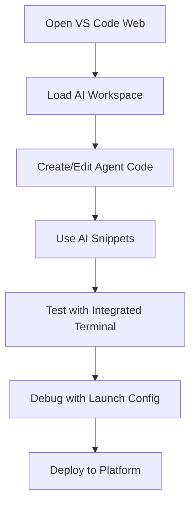

# 💻 VS Code Web Enhanced Integration

**Official VS Code Server with AI Development Workspace**  
**AI Research Platform - Tailscale Network Integration**

---

## 🚀 Overview

VS Code Web provides a full-featured, browser-based Visual Studio Code experience integrated with your AI Research Platform. This enhanced setup includes pre-configured workspaces, AI development snippets, and seamless integration with AutoGen Studio, Magentic-One, and Ollama models.

### ✅ What's Included

- **Official VS Code Server** - Full VS Code experience in browser
- **AI Development Workspace** - Pre-configured for multi-agent development
- **Custom Code Snippets** - AutoGen, Magentic-One, and Ollama snippets
- **Integrated Terminals** - Direct access to Python environments
- **Extension Marketplace** - Access to all VS Code extensions
- **Tailscale Network Access** - Available across your mesh network

---

## 🌐 Access Information

### Primary Access
- **VS Code Web**: [http://100.123.10.72:57081](http://100.123.10.72:57081)
- **Network**: Tailscale VPN (`100.123.10.72`)
- **Port**: `57081`
- **Server Type**: Official VS Code Server
- **Status**: ✅ Active and Enhanced

### Quick Access
- **Control Panel**: [http://100.123.10.72:10500/control-panel.html](http://100.123.10.72:10500/control-panel.html)
- **Applications Dashboard**: [http://100.123.10.72:10500/applications.html](http://100.123.10.72:10500/applications.html)

---

## 🎯 Enhanced Features

### AI Development Workspace
**Pre-configured workspace for AI Research Platform development**

#### Workspace Structure
```
📁 AI Research Platform/
├── 🤖 AutoGen Environment/ (Python virtual environment)
├── 📚 Documentation/ (Setup guides and README files)  
└── 🔧 Configuration Files/ (Settings, tasks, snippets)
```

#### Configured Settings
- **Python Environment**: `/home/keith/chat-copilot/autogen-env/bin/python`
- **Auto-formatting**: Enabled on save
- **Terminal Integration**: Bash with auto-activation
- **Git Integration**: Auto-fetch enabled
- **Theme**: Default Dark+ optimized for AI development

### Custom Tasks
**Pre-built VS Code tasks for AI platform management**

| Task | Description | Command |
|------|-------------|---------|
| **Start AutoGen Studio** | Launch AutoGen Studio server | `autogenstudio ui --port 8085 --host 0.0.0.0` |
| **Run Magentic-One Demo** | Execute Magentic-One platform demo | `python magentic_one_simple.py` |
| **Test Ollama Models** | List available Ollama models | `ollama list` |

### Debug Configurations
**Ready-to-use launch configurations**

- **AutoGen Examples**: Debug AutoGen workflow examples
- **Magentic-One Platform**: Debug multi-agent platform code
- **Custom Scripts**: Template for debugging your AI scripts

---

## 🎨 AI Development Code Snippets

### Available Snippets

#### 1. AutoGen Agent Creation (`autogen-agent`)
```python
from autogen_agentchat.agents import AssistantAgent
from autogen_ext.models.openai import OpenAIChatCompletionClient

# Create Ollama client
client = OpenAIChatCompletionClient(
    model="llama3.2:3b",
    base_url="http://localhost:11434/v1", 
    api_key="ollama"
)

# Create agent
agent = AssistantAgent(
    name="AgentName",
    model_client=client,
    system_message="You are a helpful AI assistant."
)
```

#### 2. Magentic-One Team Setup (`magentic-team`)
```python
from magentic_one_simple import MagenticOnePlatform
import asyncio

async def main():
    platform = MagenticOnePlatform()
    
    # Run workflow
    task = "Your task description here"
    result = await platform.run_workflow("research", task)
    
    print(f"Result: {result['final_result']}")

if __name__ == "__main__":
    asyncio.run(main())
```

#### 3. Direct Ollama API Call (`ollama-api`)
```python
import requests

def call_ollama(model: str, prompt: str):
    response = requests.post(
        "http://localhost:11434/api/generate",
        json={
            "model": model,
            "prompt": prompt,
            "stream": False
        }
    )
    return response.json()["response"]

# Usage
result = call_ollama("llama3.2:3b", "Your prompt here")
print(result)
```

#### 4. Service Testing (`test-service`)
```python
import requests

def test_ai_service(url: str, service_name: str):
    try:
        response = requests.get(url, timeout=5)
        if response.status_code == 200:
            print(f"✅ {service_name}: Active")
        else:
            print(f"❌ {service_name}: Error {response.status_code}")
    except Exception as e:
        print(f"❌ {service_name}: {e}")

# Test AI Research Platform services
services = {
    "AutoGen Studio": "http://100.123.10.72:8085",
    "OpenWebUI": "https://ubuntuaicodeserver-1.tail5137b4.ts.net",
    "Chat Copilot": "http://100.123.10.72:10500",
    "Perplexica": "http://100.123.10.72:3999/perplexica"
}

for name, url in services.items():
    test_ai_service(url, name)
```

---

## 🔌 Recommended Extensions

### AI Development Extensions
- **ms-python.python** - Python language support with IntelliSense
- **ms-toolsai.jupyter** - Jupyter notebook support
- **github.copilot** - AI-powered code completion
- **ms-toolsai.vscode-ai** - AI development tools
- **continue.continue** - Local AI code assistant

### Web Development Extensions  
- **ms-vscode.vscode-typescript-next** - TypeScript support
- **esbenp.prettier-vscode** - Code formatting
- **bradlc.vscode-tailwindcss** - Tailwind CSS IntelliSense
- **ms-vscode.vscode-html-language-features** - HTML support

### General Development
- **ms-vscode.vscode-json** - JSON language support
- **redhat.vscode-yaml** - YAML language support
- **ms-vscode.hexeditor** - Hex editor for binary files
- **ms-vscode.vscode-github-issue-prs** - GitHub integration

---

## 🚀 Getting Started Guide

### Step 1: Access VS Code Web
1. Open [http://100.123.10.72:57081](http://100.123.10.72:57081)
2. Wait for VS Code to load completely
3. You'll see the familiar VS Code interface

### Step 2: Open AI Development Workspace
1. **File** → **Open Workspace from File**
2. Navigate to `/home/keith/chat-copilot/ai-research-platform.code-workspace`
3. Click **Open** to load the pre-configured workspace

### Step 3: Install Recommended Extensions
1. Go to **Extensions** panel (Ctrl+Shift+X)
2. Click **Install Workspace Recommended Extensions**
3. Wait for all extensions to install
4. Reload VS Code when prompted

### Step 4: Explore Pre-configured Features
1. **Terminal** → **New Terminal** (opens with AutoGen environment active)
2. **View** → **Command Palette** → Type "Snippets" to see AI snippets
3. **Run and Debug** panel shows pre-configured launch options
4. **Terminal** → **Run Task** shows available AI platform tasks

### Step 5: Test Integration
1. Open a new Python file
2. Type `autogen-agent` and press Tab to use snippet
3. Use **Terminal** → **Run Task** → **Test Ollama Models**
4. Try the **Run and Debug** → **AutoGen Examples** configuration

---

## 🔧 Development Workflows

### AI Agent Development Workflow


### Multi-Agent System Development
1. **Planning**: Use VS Code for system architecture design
2. **Agent Creation**: Leverage AutoGen snippets for rapid development
3. **Team Configuration**: Build Magentic-One team setups
4. **Testing**: Use integrated terminals for testing workflows
5. **Debugging**: Use launch configurations for step-through debugging
6. **Documentation**: Create README files and documentation

### Platform Integration Development
1. **Service Testing**: Use service test snippets
2. **API Integration**: Develop connections between services
3. **Workflow Automation**: Create scripts for platform management
4. **Monitoring**: Build health check and status monitoring tools

---

## 🛠️ Configuration Files

### Workspace Settings (`settings.json`)
```json
{
  "python.pythonPath": "/home/keith/chat-copilot/autogen-env/bin/python",
  "python.terminal.activateEnvironment": true,
  "editor.formatOnSave": true,
  "editor.codeActionsOnSave": {
    "source.organizeImports": true
  },
  "files.autoSave": "afterDelay",
  "terminal.integrated.defaultProfile.linux": "bash",
  "git.autofetch": true,
  "workbench.colorTheme": "Default Dark+",
  "python.linting.enabled": true,
  "python.linting.pylintEnabled": true
}
```

### Tasks Configuration (`tasks.json`)
```json
{
  "version": "2.0.0",
  "tasks": [
    {
      "label": "Start AutoGen Studio",
      "type": "shell",
      "command": "source autogen-env/bin/activate && autogenstudio ui --port 8085 --host 0.0.0.0"
    },
    {
      "label": "Run Magentic-One Demo", 
      "type": "shell",
      "command": "source autogen-env/bin/activate && python magentic_one_simple.py"
    }
  ]
}
```

### Launch Configuration (`launch.json`)
```json
{
  "version": "0.2.0",
  "configurations": [
    {
      "name": "Python: AutoGen Examples",
      "type": "python",
      "request": "launch",
      "program": "${workspaceFolder}/autogen_examples.py",
      "python": "/home/keith/chat-copilot/autogen-env/bin/python"
    }
  ]
}
```

---

## 🔍 Troubleshooting

### Common Issues

#### VS Code Web Not Loading
```bash
# Check server status
curl -I http://100.123.10.72:57081

# Check process
ps aux | grep code

# Check port availability  
netstat -tulnp | grep 57081
```

#### Python Environment Issues
```bash
# Verify virtual environment
source /home/keith/chat-copilot/autogen-env/bin/activate
python --version

# Check installed packages
pip list | grep autogen

# Reinstall if needed
pip install autogen-agentchat autogen-ext[magentic-one,openai]
```

#### Workspace Not Loading
```bash
# Check workspace file exists
ls -la /home/keith/chat-copilot/ai-research-platform.code-workspace

# Check .vscode directory
ls -la /home/keith/chat-copilot/.vscode/

# Regenerate if needed
python vscode_web_integration.py
```

#### Extensions Not Installing
1. Check internet connectivity for extension marketplace
2. Try manually installing from VSIX files
3. Use **Command Palette** → **Developer: Reload Window**
4. Check VS Code logs in **Output** panel

---

## 🚀 Advanced Configuration

### Custom Theme for AI Development
```json
{
  "workbench.colorCustomizations": {
    "terminal.background": "#1e1e1e",
    "terminal.foreground": "#00ff00",
    "editor.background": "#0d1117",
    "sideBar.background": "#161b22"
  }
}
```

### Additional AI Development Tasks
```json
{
  "label": "Deploy AutoGen Workflow",
  "type": "shell",
  "command": "source autogen-env/bin/activate && python deploy_workflow.py",
  "group": "build",
  "dependsOn": "Test Ollama Models"
}
```

### Custom Keybindings for AI Development
```json
[
  {
    "key": "ctrl+alt+a",
    "command": "workbench.action.tasks.runTask",
    "args": "Start AutoGen Studio"
  },
  {
    "key": "ctrl+alt+m", 
    "command": "workbench.action.tasks.runTask",
    "args": "Run Magentic-One Demo"
  }
]
```

---

## 🔗 Integration with AI Research Platform

### Platform Ecosystem
VS Code Web serves as the central development environment for:

- **AutoGen Studio**: Agent development and testing
- **Magentic-One**: Multi-agent workflow creation
- **Chat Copilot**: Semantic kernel integration
- **Ollama Models**: Local AI model management
- **Platform Services**: Service development and maintenance

### Development Workflow Integration
```
VS Code Web Development → AutoGen Studio Testing → Magentic-One Deployment → Platform Integration
```

### File System Access
- **Full Access**: Complete file system navigation
- **Project Structure**: Organized workspace layout
- **Version Control**: Integrated Git support
- **Terminal Access**: Direct command line interface

---

## 📊 Performance Optimization

### VS Code Performance
- **Large File Handling**: Optimized for AI model files
- **Memory Management**: Efficient for long development sessions
- **Extension Loading**: Selective extension activation
- **Terminal Performance**: Multiple concurrent terminals supported

### Development Efficiency
- **IntelliSense**: AI-powered code completion
- **Debugging**: Step-through debugging for AI workflows  
- **Testing**: Integrated test execution and results
- **Documentation**: Live preview and editing

---

## 🎉 Conclusion

VS Code Web Enhanced Integration provides a professional-grade development environment for AI Research Platform development. With pre-configured workspaces, custom snippets, and seamless integration with all platform services, it enables:

- **Rapid AI Development** - Custom snippets and templates
- **Integrated Testing** - Direct access to all AI services
- **Professional Debugging** - Full debugging capabilities
- **Team Collaboration** - Shared workspace configurations  
- **Platform Management** - Built-in tasks and automation

Your AI Research Platform now includes enterprise-grade development tools accessible from anywhere on your Tailscale network!

---

*💻 Powered by VS Code Server | Enhanced for AI Development | Last updated: June 14, 2025*