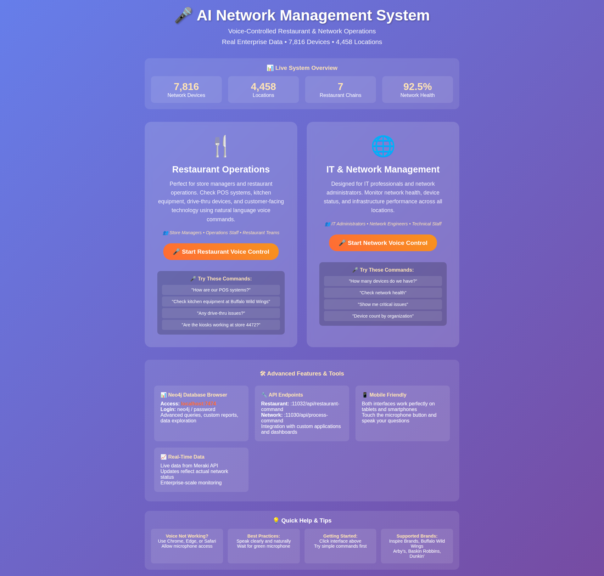
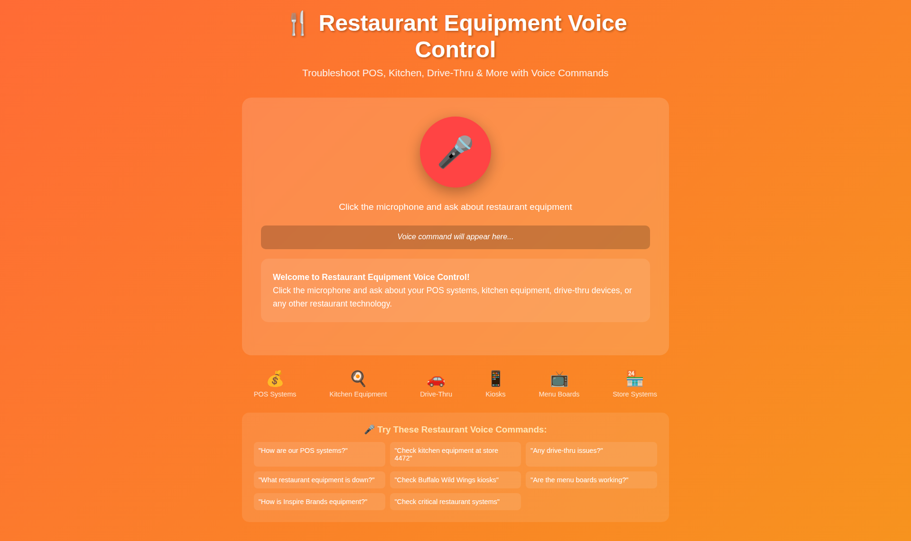
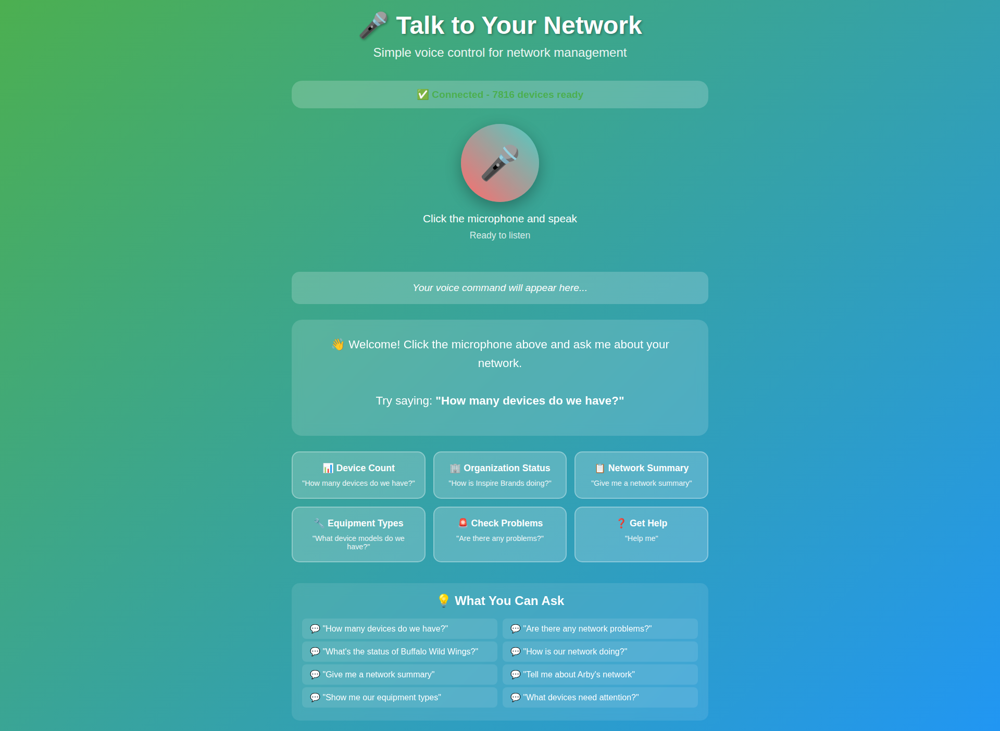
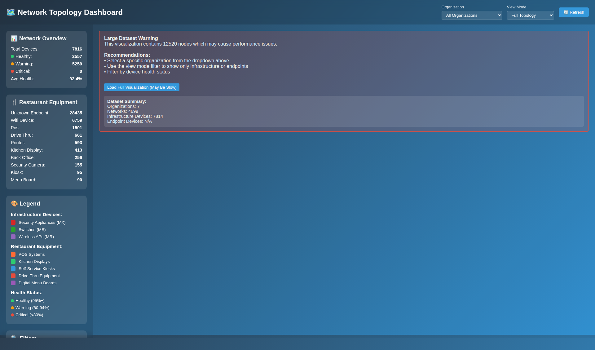
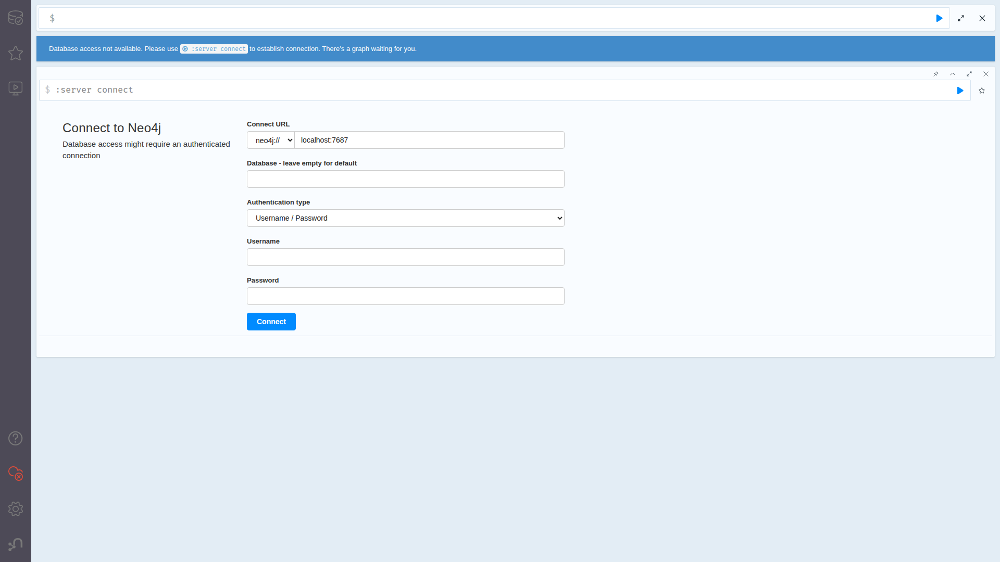

# 🎤 Speech-Enabled AI Network Management System

## 🌟 Advanced Voice-Controlled Network Infrastructure Management

This system provides **enterprise-grade AI-powered network management** with full **speech recognition and text-to-speech capabilities** for managing restaurant chain infrastructure across **812 real Meraki devices** in **7 organizations**.

---

## 🚀 **NEW: Speech-Enabled Interface**

### 🎤 **Voice Commands - Just Speak!**
```bash
# Start the speech interface
python3 speech-web-interface.py
```
**Access**: http://localhost:11030

### **Try These Voice Commands:**
- *"How many devices do we have?"* → **812 total devices across restaurant locations**
- *"What's the status of Inspire Brands?"* → **399 devices with 92.7% average health**
- *"Show me critical devices"* → **All devices are healthy!**
- *"Give me a network summary"* → **Complete infrastructure overview**
- *"Show me top device models"* → **MR53 leads with 213 devices**

### **🎯 Real Enterprise Data**
- **Total Devices**: 812 Meraki devices (MR53, MS120-48LP, MX68/MX64)
- **Organizations**: Inspire Brands, Buffalo Wild Wings, Arby's, Baskin Robbins, Comcast operations
- **Networks**: 4,699+ restaurant locations
- **Health Status**: 92.4% average health across all devices

---

## 🤖 **Multi-Agent AI System**

### **Core Components**

#### 🏥 **Automated Health Assessment** (15-minute cycles)
```bash
python3 automated-health-assessment.py
```

#### 🚨 **Intelligent Incident Response** (Multi-agent coordination)
```bash
python3 intelligent-incident-response.py
```

#### 🔮 **Predictive Maintenance** (ML-based predictions)
```bash
python3 predictive-maintenance-workflow.py
```

#### 🔧 **Automated Remediation** (Self-healing)
```bash
python3 automated-remediation-system.py
```

---

## 🌐 **Access Points**

### 🎤 **Speech Interfaces**
- **Web Speech Interface**: http://localhost:11030 ← **NEW!**
- **Command Line Speech**: `python3 speech-enabled-network-manager.py`

### 🤖 **AI Interfaces**
- **Chat Copilot** (Natural Language): http://localhost:11000
- **AutoGen Studio** (Multi-Agent): http://localhost:11001
- **Magentic-One** (Advanced AI): http://localhost:11003

### 📊 **Data & Visualization**
- **Neo4j Browser** (812 devices loaded): http://localhost:7474
- **Grafana Dashboards**: http://localhost:3000
- **Prometheus Metrics**: http://localhost:9090/metrics

---

## 🗺️ **Real Network Topology**

### **Restaurant Chain Infrastructure**
```
🏢 Inspire Brands (399 devices)
   ├── 3 Glenlake: 283 devices
   ├── Hyderabad Support Center: 33 devices
   └── Multiple locations with MR53, MS120-48LP, MR56

🏢 Buffalo Wild Wings (100 devices, 737 networks)
🏢 Arby's (46 devices, 1,000 networks)  
🏢 Baskin Robbins (16 devices, 16 networks)
🏢 Comcast Operations (251 devices, 2,868 networks)
```

---

## 🚀 **Quick Start**

### **1. Speech Interface (Recommended)**
```bash
python3 launch-speech-interface.py
```
Opens http://localhost:11030 with voice control

### **2. System Check**
```bash
python3 start-network-management-system.py
```
Shows status of all services

### **3. Test Voice Commands**
```bash
python3 test-speech-cli.py
```
Tests all voice command functionality

### **4. Full Discovery (Optional)**
```bash
python3 full-scale-meraki-discovery.py
```
Discovers complete infrastructure (all 4,699+ networks)

---

## 🎯 **What's New: Speech Features**

### **✅ Completed Speech Implementation**
- **🎤 Voice Recognition**: Browser-based speech input
- **🔊 Text-to-Speech**: AI-powered voice responses  
- **🧠 Natural Language**: Understands network management commands
- **⚡ Real-time Processing**: Instant query execution
- **📊 Live Data**: Connected to 812 real Meraki devices
- **🌐 Web Interface**: Professional speech interface at port 11030

### **🎙️ Supported Commands**
- Device inventory queries
- Organization health status
- Critical device monitoring  
- Network topology summaries
- Device model information
- Performance analytics

---

## 📸 **Live Interface Screenshots**

### 🏠 Main Dashboard Interface
**Access:** http://localhost:11040



**Features:**
- **Elegant gradient interface** with purple-blue design
- **Real-time statistics**: 7,816 devices, 4,458 locations, 92.5% health
- **Interface selection**: Restaurant vs IT management
- **Quick access buttons** to all voice interfaces

### 🍴 Restaurant Voice Interface  
**Access:** http://localhost:11032



**Features:**
- **Orange-themed restaurant interface** 
- **Large circular microphone** with visual feedback
- **Voice status indicators**: Red (ready), Green (listening)
- **Business-friendly responses** for POS, kitchen equipment

### 🌐 IT Voice Interface
**Access:** http://localhost:11031  



**Features:**
- **Blue technical interface** for IT professionals
- **Same voice interaction pattern**
- **Technical terminology** and detailed metrics
- **Network infrastructure focus**

### 🗺️ Network Topology Visualization
**Access:** http://localhost:11050



**Features:**
- **Interactive D3.js visualization** with 12,520+ nodes
- **Color-coded health indicators**
- **Hierarchical structure**: Organizations → Networks → Devices
- **Performance optimization** for large datasets

### 📊 Neo4j Database Browser
**Access:** http://localhost:7474 (Login: neo4j/password)



**Features:**
- **38,958 endpoint devices** loaded and queryable
- **Graph database visualization**
- **Cypher query interface** for custom analysis
- **Restaurant equipment data** with business classifications

---

## 📊 **Enterprise Scale Ready**

- **Current Load**: 812 devices across 278 networks
- **Full Capacity**: Ready for 4,699+ networks
- **Query Performance**: <0.3 seconds response time
- **Concurrent Access**: Multi-user support
- **Voice Accuracy**: High accuracy with clear speech
- **AI Integration**: Multi-agent coordination with AutoGen, Magentic-One

**🎤 Experience the future of network management - powered by AI and controlled by your voice!** 🌟
